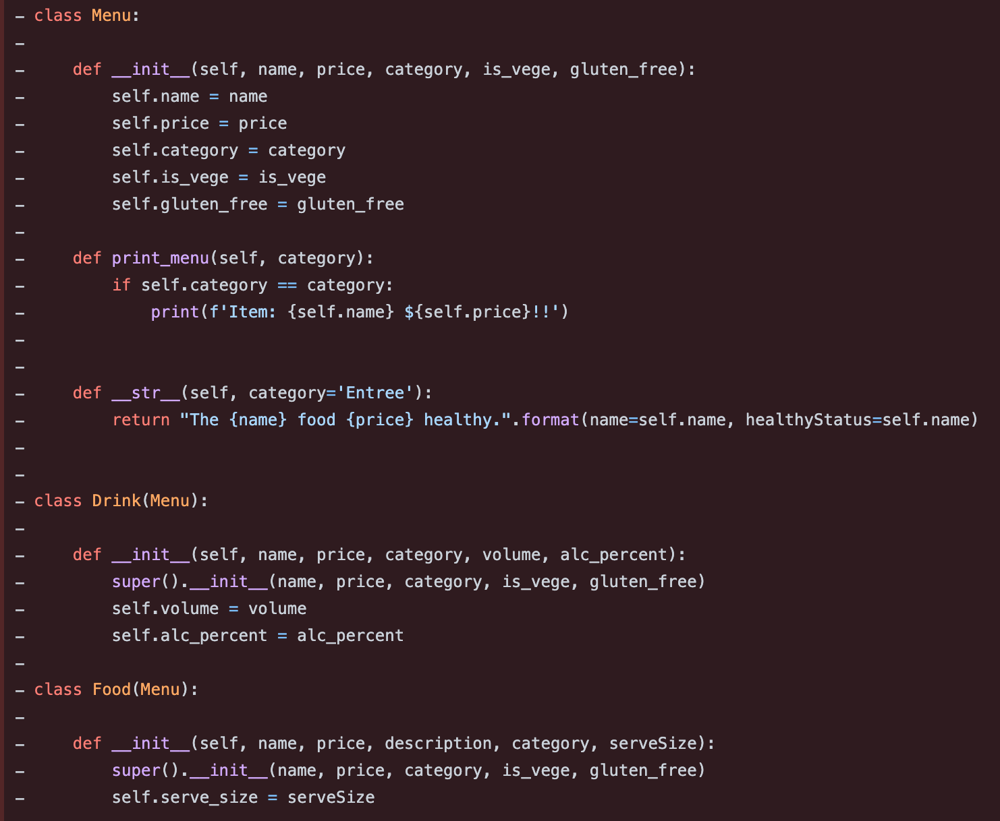
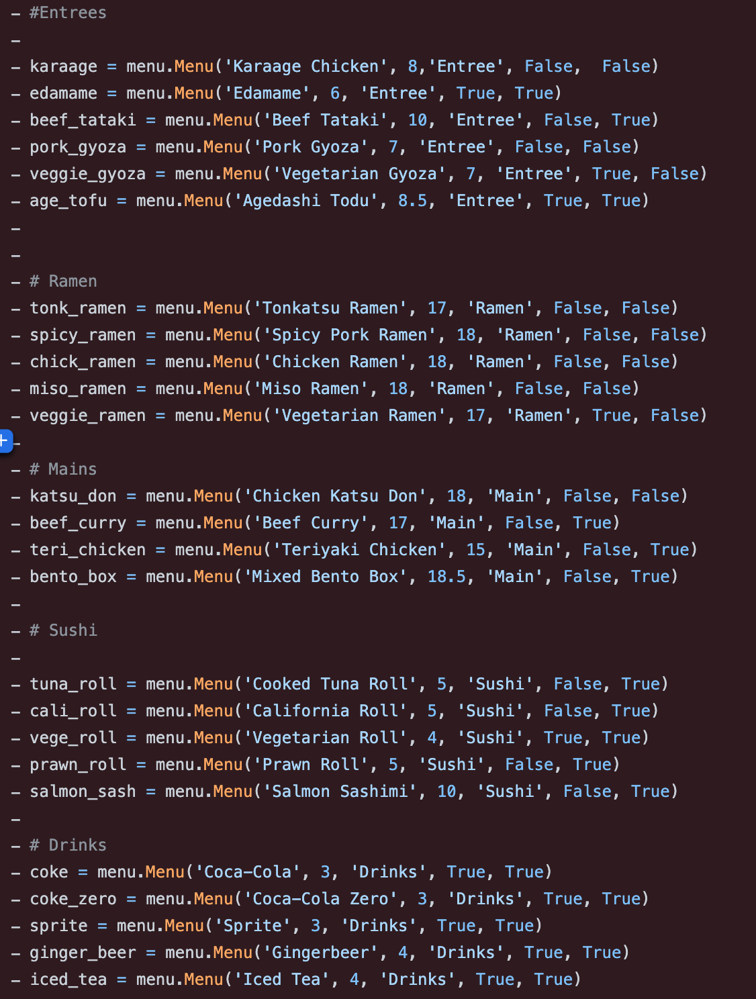
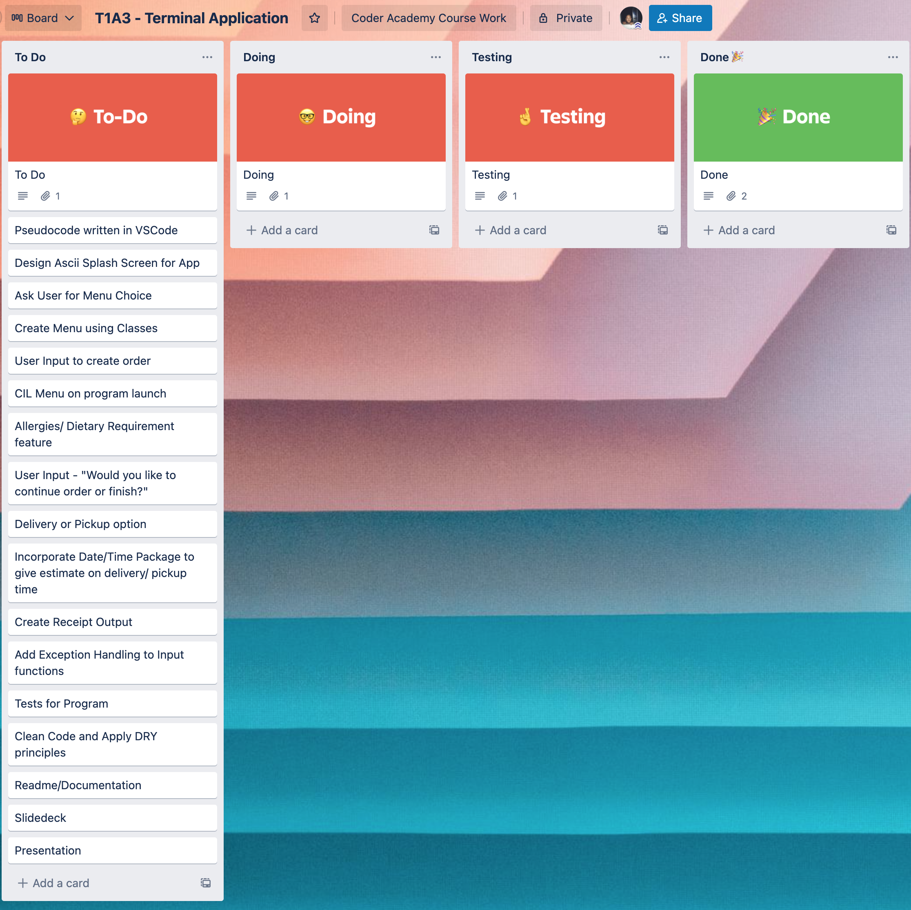
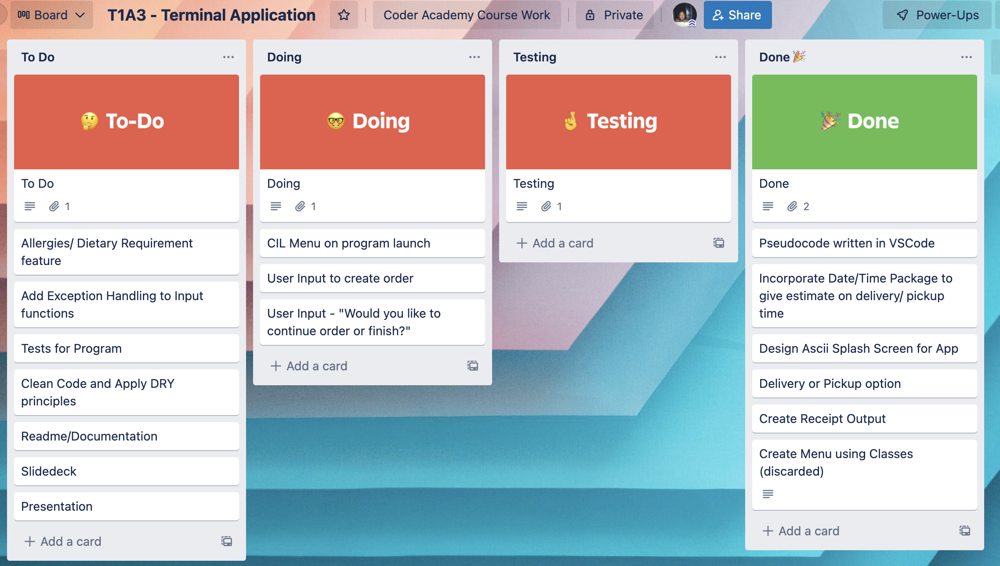
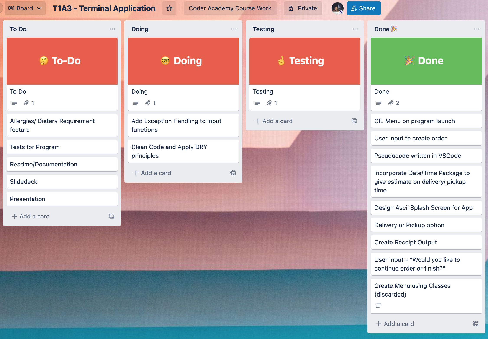
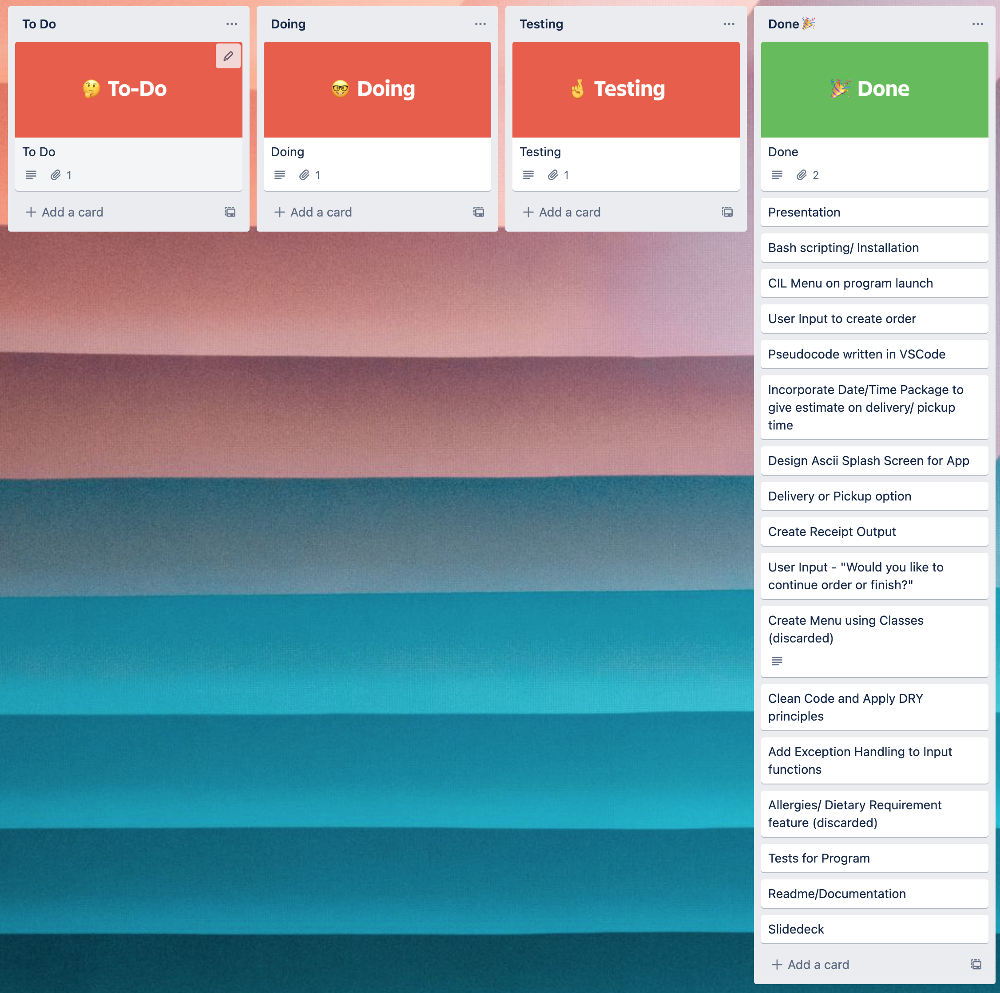

# T1A3 - Terminal Application


## Adam Tunchay

### Student Number - 13537

### WDA2022-02
---
## **McFoo Food Ordering Application**

## Links
### [GitHub Repository](https://github.com/ad0maa/T1A3-terminal-app)
### [Video Presentation](https://youtu.be/bEBTNi3X0CY)
### [Trello Board](https://trello.com/b/5XUqSFbA/t1a3-terminal-application)
---
## Installation Instructions

### Requirements
Before cloning and running the McFoo Food Ordering Application you need to make sure you have the following installed on your system.

- Python - Available for download - [Here](https://www.python.org/downloads/release/python-3107/)

1. In your preffered command line application run the following command in a directory of you choice.
    
```bash
git clone git@github.com:ad0maa/T1A3-terminal-app.git
```

2. Next you must change into the src directory within the folder. Run the following command.
```bash 
cd T1A3-terminal-app/src
```
3. Finally, run the following command to execute the installation script.
```bash
bash install.sh
```

If you've successfully followed those steps, you should be seeing the application splash screen. Enjoy!

---
## Features

### Food Menu and Ordering

The application provides the user the ability to view and order items from the menu which is stored within a dictionary in the applcation. Through user input, the food menu is displayed on screen with numbers that correspond to the food items. The user can select to 'place an order' which adds the food item by index to an empty list that continues to add items as the user inputs their order.

Alongside adding items to the order, the application also keeps track of the total cost of the order. At any time the user can ask to display the current order and subtotal.

The user also has the ability to clear the order from the main menu if they want to start a new order from scratch.

### Delivery Options

Once food items have been ordered by the user, the next step is to finalize the order and the application asks whether the order is for delivery or pickup. Depending on the response, an additional delivery fee is added to the order. This decision provides the application with a boolean value which is later used when providing the customer with a time for pickup or delivery. Using the 'datetime' package, the current time is used to tell the customer when the order is placed. If the order is for delivery, a message is provided to the customer indicating expected delivery time (current time + 40 mins). If the order is a pickup order, a different message is provided and again using datetime a pickup time given to the customer (current time + 20 mins).

### Receipt Printing 

Once the customer has finished their order and selected their delivery option, a receipt is printed to the terminal using a package called 'PrettyTable' for formatting. PrettyTable pulls values from the order list as well as the total price value. If the user has selected delivery, the delivery item and price is added to the receipt also. Upon the receipt being printed the user is then asked if they would like to print the receipt to a file. This function prints out the PrettyTable receipt to a file called receipt.txt with some additional information including the time that the order was placed.

---

## Implementation Plan

Originally I had pitched to make a Tic Tac Toe application for this assessment. I spent my first day of production attempting to work out the logic on this project but was overwhelmed by the difficulty, so I had a chat with the educators and decided on a food delivery application instead.

The next day I began by writing pseudocode for the development of the food delivery application. I attempted to create the menu using classes and began developing instances of various menu items. I was able to include additional information using OOP (such as gluten free and vegetarian boolean values which I intended to be able to show only certain menu items based off user preferences). I was excited to develop the application using OOP to further my understanding of this kind of data structures. Unfortunately when I began to code the actual workings of my application, I found it very difficult to extract the values I needed from the instances of the menu. In the end I decided to change from a class based menu, to using a dictionary for my menu. So on the morning of day 3 I started the application from scratch again. I have left the early commits in my repository as a reference of my attempt using OOP.

Here are some screenshots of my original Menu using classes.





Once I began working with a dictionary based menu things moved a lot quicker. I had a better understanding of manipulating the values of the dictionary in the way I needed and overall I am happy with the functionality of the project. It was rewarding putting different elements together to get a useful functioning application. The hardest part of this assignment was certainly the timeframe. There are additional features that I would have loved to implement in this assignment but due to changing project ideas and then starting over when I tried to simplify the application, I just did not have the time on hand to implement.

I am looking forward to going back through this application and implementing additional features for my own learning experience.

Below are some progress pictures from my Trello board.






---
## Input Validation
The function get_input() was created to be used instead of Python's builtin input() in order to validate the users input through out the application. All inputs by the user are required to be an integer that correlates to an item on the current menu. This function makes sure that the user is only inputting a number by using the isdigit() function. If the user is to input a string or invalid menu number, an error message appears and the user will need to input a valid number.

---
## Manual Testing

Feature | Test | Expected Outcome | Actual Outcome | Issues
--- | --- | --- | --- | ---
**Splash Screen** | User is asked to press 'enter' to continue | Main menu is displayed when enter is pressed | As expected | User can type when asked to press enter. Even if a value is given, pressing enter still advances to main menu. Not a major issue, but would be cleaner to code this out in future release.
**Main Menu (User is asked to enter a number that corresponds to menu item.)** |Valid Integer is entered. | Menu changed to relevent page|As expected | No issues |
| | String is entered| Error message provided asking for valid input|As expected | No issues |
| | Wrong integer entered| Error message provided asking for valid input|As expected | No issues |
|**View Menu**|View Food Menu is selected from main menu |Menu items and prices are displayed to user with number for indexing prefixed to values|As expected | No issues |
|**Place Order - User is asked what they would like to order** |String is entered|Error message provided asking for valid input |As expected | No issues |
| |Float entered |Error message provided asking for valid input |As expected | No issues |
| | Valid Integer is entered.|"item name" added to order and displayed on screen. Item and price added to order_items list |As expected | No issues |
**View Current Order** |Select from menu to display current order and subtotal | (item) - (price) printed for each item that has been added. Current total price printed below.|As expected | No issues |
**Finalize Order** |User selected Delivery |Delivery fee is added to order and updated total printed. Receipt prints to terminal. Delivery = True returned |As expected | No issues |
| | User selected Pickup| Receipt prints to terminal, no delivery fee added.|As expected | No issues |
|**Receipt to File Function (User is asked whether or not to save receipt to file)** | User selects 'Yes'| Message informing receipt has been saved, order placed time and date provided, message with pickup / delivery time provided|As expected | No issues |
| |User selects 'No' | Order placed time and date provided, message with pickup / delivery time provided |As expected | No issues |
|**Quit Application**|User provides '0' at main menu to exit application|Goodbye message provided, application exited. |As expected | No issues |